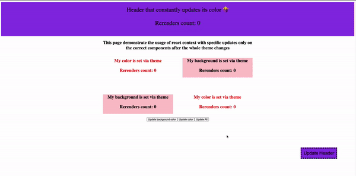

# Theme Provider + Performant context

This project is a test case of the library `use-context-selector` that let us to create a context and use selectors to retrieve the portion of the state that is interesting for a given component, and with this approach there's a huge benefit on perfomance cause even if the whole context object changes only the components that are affected by a specific property are updated.

## Features

- Header that changes color on scroll and on click
- Boxes that update their colors with clicks
- All the theme is kept in a single context
- All the re-renders are displayed in numbers

## Demo

## Acknowledgements

- [use-context-selector](https://www.npmjs.com/package/use-context-selector)